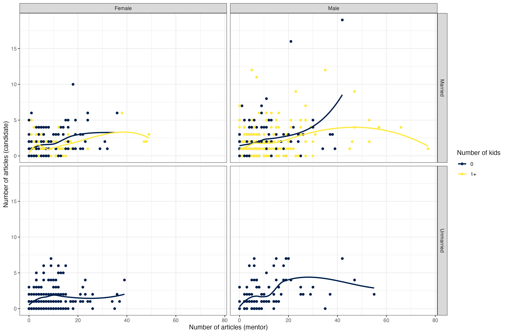
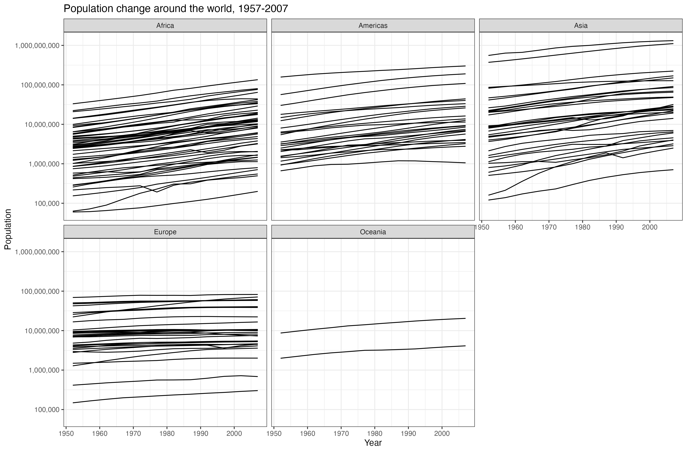

Upload a completed version of this notebook to Canvas when done.

See website for an overview, submission details, and more information on the data-set 

* Put this folder into a R-project that has access to the `renv` environment 
  * Alternatively, you can copy `renv` and `renv.lock` files into this folder
  * If you are on Mac or Linux you can use a soft link `ln -s path_to_renv_folder/ren* ./`
  
## Set environment 
```{r}
renv::restore()

library(tidyverse)
library(rio)
```


## HW-1.2.1

Re-create the following plot as closely as possible. 



```{r}
# INSERT CODE HERE
library(ggplot2)

df <- read.csv('./hws/hw1/PhDPublications.csv')

# preprocessing
df$kids <- ifelse(df$kids > 0, "1+", "0")
df$gender <- factor(df$gender, levels = c("female", "male"), labels=c("Female", "Male"))
df$married <- factor(df$married, levels = c("yes", "no"), labels=c("Married", "Unmarried"))


g <- ggplot(df, aes(mentor, articles, color = kids)) + 
  geom_point(size=2) + # scatterplot
  geom_smooth(lwd=1.2, method = "loess", se = FALSE) + # regression line
  facet_grid(married ~ gender, labeller = label_value) + # facet row = married, col = gender
  scale_color_manual(values=c("darkblue", "yellow"), labels=c("0", "1+")) + # diff. color based on # of kids
  scale_x_continuous(limits = c(-6, 85), expand = c(0, 0)) + # axes limits
  scale_y_continuous(limits = c(-1, 18), expand = c(0, 0)) +
  theme(aspect.ratio = 0.8,
        axis.title.x = element_text(size=14), # axes titles
        axis.title.y = element_text(size=14),
        strip.text.x = element_text(size=14), # margin axes titles
        strip.text.y = element_text(size=14),
        strip.background = element_rect(fill='grey', color='black'),
        legend.key = element_rect(fill='white'), # legend formatting
        legend.title = element_text(size=14),
        legend.position = "right",
        panel.background = element_rect(fill='white'), # panel formatting
        panel.border = element_rect(color = "black", fill = NA, linewidth = 0.5),
        panel.grid.major = element_line(color='gray'),
        panel.grid.minor = element_line(color='gray90')) +
  labs(x="Number of articles (mentor)", # axes + legend labels
       y="Number of articles (candidates)", 
       color = "Number of kids")

g
```

## HW-1.2.1

Re-create the following plot as closely as possible. 




```{r}
# INSERT CODE HERE
library(gapminder)

data("gapminder")

g <- ggplot(gapminder, aes(x=year, y=pop)) +
  geom_line(aes(col=continent, group=country)) + # regression line
  scale_color_manual(values = rep("black", 5), guide=FALSE) + # force all lines to be black
  facet_wrap(~continent, ncol=3) + # facet based on continent
  scale_y_log10(labels = function(x) format(x, scientific = FALSE, big.mark = ",")) + # make y axis log scale
  theme(panel.background = element_rect(fill='white'), # panel styling
        panel.grid.major = element_line(color='gray'),
        panel.grid.minor = element_line(color='gray90'),
        panel.border = element_rect(color = "black", fill = NA, linewidth = 0.5),
        axis.text.x = element_text(size = 10), # axes styling
        axis.text.y = element_text(size = 10),
        axis.title.x = element_text(size = 10),
        axis.title.y = element_text(size = 10),
        plot.title = element_text(size = 12),
        strip.background = element_rect(fill='grey', color='black')) + # outer box around continents
  labs(x = "Year", y = "Population", title = "Population change around the world, 1957-2007") + # axes labels + title
  xlim(1950, 2007) + # x axis
  coord_fixed(ratio = 12)

g
```
